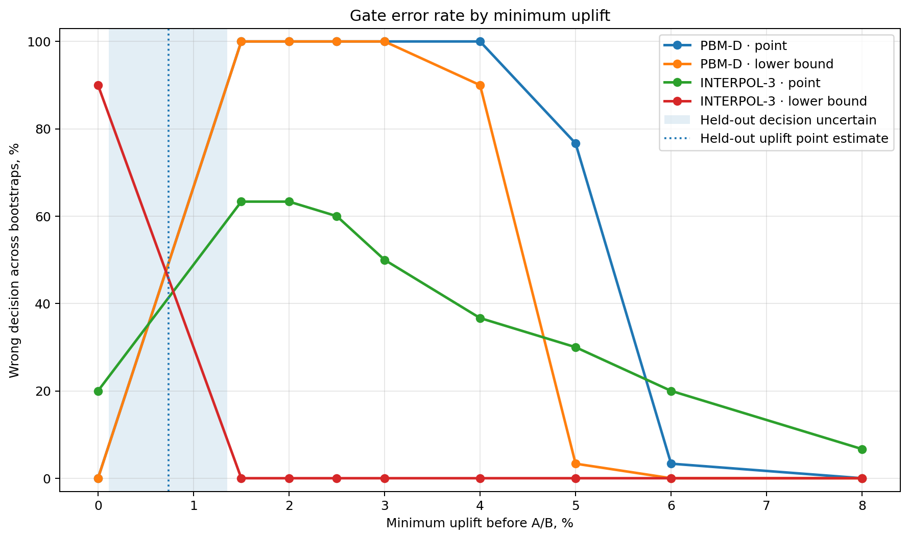

# Amazon Music OPE gate

A small check of what happens when an off-policy estimate is used as a hard gate before A/B.

Data and estimator code come from Amazon Music's public OPE benchmark. The target policy is also provided by Amazon; no ranker is trained here.

## Result

In this sample, the target policy's held-out uplift over the logging policy is about **+0.74%**.  
Using the benchmark-reported intervals gives a conservative uplift range of roughly **+0.11% to +1.35%**.

For minimum-uplift bars of **1.5–3%**, the candidate is below the bar on held-out data.

- `PBM-D / point`: passes in 30/30 bootstrap resamples
- `PBM-D / lower bound`: passes in 30/30

At a **0%** bar, the candidate is above the bar on held-out data.

- `INTERPOL-3 / lower bound`: rejects in 27/30 bootstrap resamples

So the practical thing to check is not only estimator error, but the gate built on top of it: which candidates it lets through and which it kills.



## Setup

- D1: 250k random rows for the held-out target-policy value
- D2: 200k random rows for OPE
- 30 bootstrap resamples of 100k D2 rows
- estimators: PBM-D and INTERPOL-3
- uplift bars: 0%, 0.5%, 1%, 1.5%, 2%, 2.5%, 3%, 4%, 5%, 6%, 8%

Thresholds inside the held-out uplift range are marked `uncertain` and are not scored as right or wrong.

## Files

```text
analysis.ipynb
scripts/reproduce.py
scripts/plot_gate.py
results/
figures/
```

## Reproduce the chart

```bash
pip install pandas matplotlib
python scripts/plot_gate.py
```

## Full run

Clone Amazon's benchmark repo into this directory:

```bash
git clone https://github.com/amazon-science/music-off-policy-evaluation-benchmark.git
pip install -r requirements.txt
python scripts/reproduce.py
python scripts/plot_gate.py
```

The Amazon dataset is not included in this repository.

## Caveats

This is one target policy, not a benchmark over many candidate rankers. The 30 bootstrap runs are resamples of the same logged data, not 30 independent experiments. The uplift range is a conservative envelope from the benchmark-reported intervals, not a joint confidence interval.

## Sources

- https://github.com/amazon-science/music-off-policy-evaluation-benchmark
- https://huggingface.co/datasets/amazon/music-off-policy-evaluation-benchmark
- https://arxiv.org/abs/2210.09512
