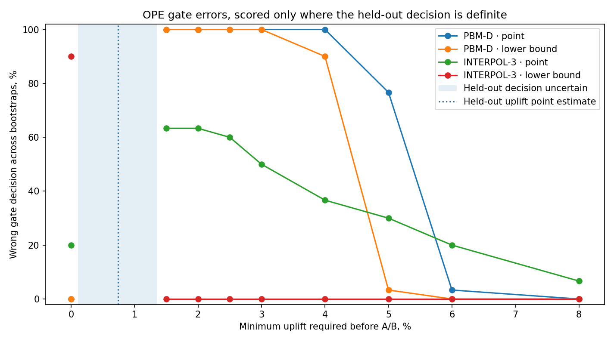

# Amazon Music OPE gate

What happens if an off-policy estimate is used as a hard gate before a candidate
gets an A/B slot — not just how accurate the estimate is, but how the gate built
on top of it behaves.

Data, the logging policy, and the target policy all come from Amazon Music's
public OPE benchmark. No ranker is trained here; the target policy is the one
Amazon released with the benchmark.

This is one target policy, evaluated on random subsamples of one logged
dataset. The bootstrap resamples below are 30 draws from the same D2 sample,
not 30 independent experiments. Treat everything here as a single case study,
not a general claim about any estimator.

## Setup

- D1 (250k rows) and D2 (200k rows): uniform random samples drawn across the
  full benchmark split, via Parquet row-group indexing — not the first N rows.
- D1 gives the held-out target-policy value. D2 is used for OPE.
- 30 bootstrap resamples of 100k rows from D2, run sequentially (the
  benchmark's interval code uses NumPy's global RNG, so parallelizing would
  break reproducibility).
- Estimators: `PBM-D` and `INTERPOL-3`, from Amazon's benchmark code,
  unmodified. `INTERPOL-3` was proposed specifically to trade off the bias of
  position-based models against the variance of item-position models
  (Buchholz, London, di Benedetto, Joachims, 2022 — arXiv:2210.09512). If this
  notebook reproduces that bias/variance pattern, that's a reproduction, not a
  new finding.
- Gate rule: pass a candidate to A/B if estimated uplift over the logging
  policy clears a minimum bar. Tested both on the estimator's point estimate
  and on its reported lower bound.

## Held-out reference

The target policy's actual uplift over the logging policy, measured on the
held-out D1 sample:

| | value |
|---|---|
| held-out uplift | +0.74% |
| conservative range (from benchmark-reported intervals) | +0.11% to +1.35% |

The range is a conservative envelope built by combining the benchmark's
reported intervals for the logging and target policy values. It is not a
newly calibrated joint confidence interval — treat it as a rough band, not an
exact interval.

Any minimum-uplift bar that falls inside that range doesn't have a definite
right answer from this held-out data, so gate decisions at those bars aren't
scored below. Only bars clearly above the range (definite fail — the
candidate should not pass) or clearly below it (definite pass — it should)
are counted as correct or wrong.

## Result

At bars from 1.5% to 3% — clearly above the held-out range, so the candidate
should not pass — `PBM-D` sends it to A/B anyway in every one of the 30
resamples, whether you gate on the point estimate or the lower bound.

At a 0% bar — clearly below the held-out range, so the candidate should
pass — `INTERPOL-3` gated on its lower bound rejects it in 27 of 30 resamples.

So in this sample, the two estimators fail in opposite directions once
they're wired into a fixed threshold: one keeps waving through a candidate
that shouldn't clear the bar, the other keeps blocking one that should.



The shaded band is where the held-out data doesn't support a definite
PASS/FAIL label, so no error rate is plotted there.

## What this does and doesn't show

It doesn't show that `PBM-D` or `INTERPOL-3` are generally miscalibrated —
that would need many target policies, not one. What it does show: estimator
validation (how close is the point estimate, how often does the interval
cover the truth) doesn't tell you how a specific gate threshold built on that
estimator will behave. That's a separate question, and worth checking
directly if a fixed OPE threshold is deciding who gets an A/B slot in a
constrained experimentation system.

## Files

```
analysis.ipynb        full run: sampling, estimators, bootstrap, gate, figure
scripts/make_figure.py rebuilds the figure from results/ without recomputing
results/               CSVs backing the numbers above
figures/                the chart
```

## Reproducing

Rebuild just the figure from the checked-in results:

```
pip install -r requirements.txt
python scripts/make_figure.py
```

Full run against the benchmark (not included in this repo):

```
git clone https://github.com/amazon-science/music-off-policy-evaluation-benchmark.git
pip install -r requirements.txt
jupyter notebook analysis.ipynb
```

## Sources

- https://github.com/amazon-science/music-off-policy-evaluation-benchmark
- https://huggingface.co/datasets/amazon/music-off-policy-evaluation-benchmark
- https://arxiv.org/abs/2210.09512
